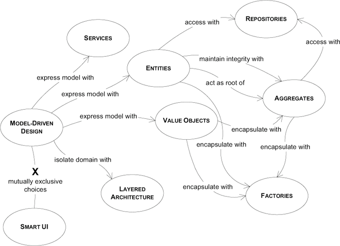
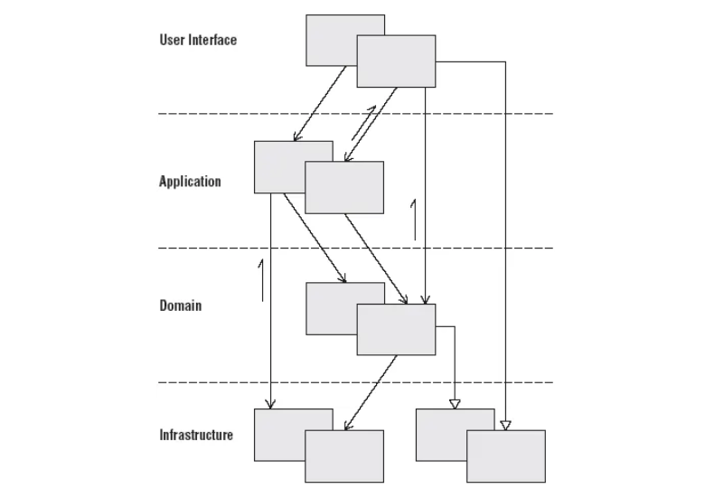

# DDD

> 소프트웨어 복잡함의 본질은 문제 도메인 자체에서 기인한다.

## 전제

> 1. 대부분의 소프트웨어 프로젝트에서는 가장 먼저 도메인과 도메인 로직에 집중해야 한다.
2. 복잡한 도메인 설계는 모델을 기반으로 해야 한다.

## 가정

> 1. 개발은 반복주기를 토대로 진행돼야 한다.
2. 개발자와 도메인 전문가는 밀접한 관계에 있어야 한다.

반복주기 → 지속적인 리팩토링 → 작은 재설계가 연속적으로 일어남 → agile

## 목차

1부. 동작하는 도메인 만들기

- 도메인 주도 설계의 목표 제시. 용어 정의

2부. 모델 주도 설계의 기본 요소

- Best Practice 핵심 요약. 모델과 구현 각각을 상호보완하는 의사결정.

3부. 더 심층적인 통찰력을 향한 리팩터링

- 실용적인 모델을 만드는 탐구 과정. 모델링 원칙 제시

4부. 전략적 설계

- 레거시 혹은 복잡하고 큰 시스템과의 상호작용. 컨텍스트, 디스틸레이션, 대규모 구조를 구성하는 원칙.

# 1부_ 동작하는 도메인 모델 만들기

> 모든 소프트웨어 프로그램은 그 소프트웨어를 사용하는 사용자의 활동이나 관심사와 관련돼 있다.

- **도메인** : 사용자가 프로그램을 사용하는 대상 영역
- **모델** : 지식을 선택적으로 단순화, 구조화한 형태. 도메인의 복잡성을 해소하기 위한 도구.

### DDD 에서 모델의 유용성

> 1. 모델과 핵심 설계는 서로 영향을 주며 구체화된다.
2. 모델은 모든 팀 구성원이 사용하는 언어의 중추다.
3. 모델은 지식의 정수만을 뽑아낸 것이다.

## 01_지식 탐구

### 효과적인 모델링의 요소

> 1. 모델과 구현의 연계
2. **모델을 기반으로 하는 언어 정제**
3. 풍부한 지식이 담긴 모델 개발
4. 모델의 정제
5. 브레인스토밍과 실험

- 폭포수 개발 방법의 경우
    - 업무 전문가 → 분석가 → 프로그래머
    - 지식이 한 방향으로만 흐르고 축적되지 못함
- 반복 프로세스를 활용하지만 추상화를 하지 않는 경우
    - 프로그래머가 이면에 숨겨진 원리를 알지 못한 채 수정해야 할 사항만 습득
    - 기존 기능의 자연스러운 결과로 새로운 강력한 기능이 나타나지는 못함

### 풍부한 지식이 담긴 설계

> 도메인에 관련된 **엔티티**만큼 **업무 활동**과 **규칙**도 도메인에 중요

> 대개 도메인 전문가는 업무 과정에서 **모든 업무 규칙을 차례로 확인하고, 모순되는 사항을 조정하며, 상식적인 선에서 규칙의 빈틈을 메울** 때 자신이 수행하는 지적 작용이 얼마나 복잡한지 알아차리지 못한다. **소프트웨어**는 (...) **규칙을 명확하게 하고, 구체화하며, 조정하거나 고려해야 할 범위 밖으로 배제**

**예제 : 선박 화물의 운송 예약 App**

> 규칙은 일종의 **정책(policy)** (...) 정책이란 잘 알려진 **STRATEGY 디자인 패턴**의 또 다른 이름 (...) 대개 정책은 각종 규칙을 대체할 필요성 때문에 만들어지므로 (p.21)

## 02_ 의사소통과 언어 사용

> 도메인 모델은 (...) 공통 언어의 핵심이 될 수 있다.

> 모델 기반 의사소통은 통합 모델링 언어(Unified Modeling Language, UML) 상의 다이어그램으로 한정돼서는 안 된다. 모델을 가장 효과적으로 사용하려면 모든 의사소통 수단에 스며들 필요가 있다. (...) 약식 다이어그램과 형식에 얽매이지 않는 의사소통을 비롯해 텍스트 문서의 유용성도 향상된다.

> 프로젝트에서 사용되는 언어가 분열되면 (...) 자신들만의 언어를 사용한다. (...) 일상적인 토론에서 쓰이는 용어가 코드에 녹아든 용어와 단절된다. (...) 도메인의 가장 간결하고 명확한 표현이 일시적인 형태로 나타났다가 코드나 문서에도 담기지 않는 결과 (...)

> **모델을 언어의 근간으로 사용하라. 팀 내 모든 의사소통과 코드에서 해당 언어를 끊임없이 적용하는 데 전념하라. 다이어그램과 문서에서, 그리고 특히 말할 때 동일한 언어를 사용하라.**

> **UBIQUITOUS LANGUAGE의 변화가 곧 모델의 변화라는 것을 인식하라.**

> 도메인 전문가는 도메인을 이해하는 데 부자연스럽고 부정확한 용어나 구조에 대해 반대 의사를 표명해야 한다. 개발자는 설계를 어렵게 만드는 모호함과 불일치를 찾아내는 데 촉각을 곤두세워야 한다.

### 문서와 다이어그램

- UML 다이어그램
    - 장점 : 객체 간의 관계, 상호작용을 보임
    - 단점 : 해당 객체의 개념적 정의 전달 X
- 간결하고 형식에 얽매이지 않은 UML 다이어그램 그리기
    - 당면한 쟁점에서 가장 중심이 되는 3~5개 객체에 대해 다이어그램 밑그림 그리기
    - 객체 간의 관계를 바라보는 관점, 더 중요한 객체의 이름에 대해 얘기하기

> **속성**과 **관계**는 객체 모델의 반 정도를 차지할 뿐 (...) 객체의 **행위(behavior)**와 **제약조건(constraint)**은 그리기가 수월하지 않다.

> 모델은 다이어그램이 아니라는 점을 항상 명심 (...) 다이어그램의 목적은 모델을 전달하고 설명하는 데 있다.

### 글로 쓴 설계 문서

> 문서는 코드와 말을 보완하는 역할을 해야 한다.

> 문서는 유효한 상태를 유지하고 최신 내용을 담고 있어야 한다.
(...) 문서를 최소한으로 유지하고 코드와 대화를 보완하는 데 집중함으로써 문서는 프로젝트와 연관된 상태로 유지할 수 있다.

### 설명을 위한 모델

> 설명을 위한 모델이 꼭 객체 모델일 필요는 없으며, (...) 실제로 이러한 모델에서는 UML 사용을 자제하고 UML과 소프트웨어 설계와의 관련성에 관해 잘못된 인상을 주지 않는 것이 좋다.

## 03_모델과 구현의 연계

- 분석 모델
    - 업무 도메인의 개념만을 체계화하고자 해당 업무 도메인을 분석한 결과물
    - 구현 관심사와 섞일 경우 혼란만 초래하는 것으로 여겨짐

### MODEL-DRIVEN DESIGN

- 설계 및 프로그래밍 모두의 목적을 달성하는 **단일 모델**을 찾음 → 모델과 설계를 연결
    - 분석과 설계 과정에서 모두 효과적인 모델 필요

> 소프트웨어 시스템의 일부를 설계할 때는 도메인 모델을 있는 그대로 반영해서 설계와 모델의 대응을 분명하게 하라.

> 구현을 모델과 그대로 묶으려면 보통 객체지향 프로그래밍과 같은 모델링 패러다임을 지원하는 소프트웨어 개발 도구와 언어가 필요하다.

### HANDS-ON MODELER (실천적 모델러)

> MODEL-DRIVEN DESIGN에서 코드는 모델의 한 표현으로 볼 수 있다. **코드를 변경하는 것이 곧 모델의 변경**에 해당한다. (...) 프로그래머가 훌륭한 모델링 업무를 할 수 있게 프로젝트를 구성하는 것이 바람직하다.

> 코드를 변경하는 책임이 있는 모든 이들은 **코드를 통해 모델을 표현하는 법을 반드시 배워야 한다**. 모든 개발자는 모델에 관한 일정 수준의 토의에 깊이 관여해야 하고 도메인 전문가와도 접촉해야 한다. 다른 방식으로 모델에 기여하는 사람들은 의식적으로 코드를 접하는 사람들과 UBIQUITOUS LANGUAGE를 토대로 모델의 아이디어를 나누는데 적극 참여해야 한다.

# 2부_ 모델 주도 설계의 기본 요소

> 이 책에서는 (...) 근본적인 설계 원칙에 관해서는 소개하지 않는다. **도메인 주도 설계는 어떤 틀에 박힌 생각의 중점을 옮긴다.**

> 미묘한 모델의 특징과 설계 의사결정이 어떻게 도메인 주도 설계 과정에 영향을 주는지 보여주겠다.

> 소프트웨어 시스템에서 도메인 설계 외의 수많은 관심사로부터 도메인 설계를 격리하면 모델과 설계의 관계가 훨씬 분명해질 것이다.

- Model-Driven Design의 언어로 구성된 네비게이션 맵 (navigation map)
    - 패턴과 각 패턴들이 서로 어떻게 관계를 맺는지 보여줌

## 04_도메인의 격리

> (...) 시스템에서 도메인과 관련이 적은 기능으로부터 도메인 객체를 분리할 필요가 있으며, 그렇게 해서 도메인 개념을 다른 소프트웨어 기술에만 관련된 개념과 혼동하거나, 또는 시스템이라는 하나의 큰 덩어리 안에서 도메인을 전혀 바라보지 못하는 문제를 방지할 수 있다.

### LAYERED ARCHITECTURE (계층형 아키텍처)

> 매우 복잡한 작업을 처리하는 소프트웨어를 만들 경우 관심사의 분리(separation of concern)가 필요하며, 이로써 격리된 상태에 있는 각 설계 요소에 집중할 수 있다.

> 계층화의 핵심 원칙은 한 계층의 모든 요소는 오직 같은 계층에 존재하는 다른 요소나 계층상 "아래"에 위치한 요소에만 의존한다는 것이다. 위로 거슬러 올라가는 의사소통은 반드시 간접적인 메커니즘을 거쳐야 하며, (...)

> 하위 수준의 객체가 상위 수준의 객체와 소통해야 할 경우에는 (직접적인 질의에 응답하는 것 이상으로) 또 다른 메커니즘이 필요한데, 이 경우 콜백(callback)이나 OBSERVER(관찰자) 패턴처럼 계층 간에 관계를 맺어주는 아키텍처 패턴을 활용할 수 있다.

### 도메인 계층은 모델이 살아가는 곳

> 도메인 모델은 일련의 개념을 모아놓은 것이다. "도메인 계층"은 그러한 모델과 설계 요소에 직접적으로 관계돼 있는 모든 것들을 명시한 것이다. 도메인 계층은 업무 로직에 대한 설계와 구현으로 구성된다. MODEL-DRIVEN DESIGN에서는 도메인 계층의 소프트웨어 구성물이 모델의 개념을 반영한다. (...) 따라서 도메인 주도 설계의 전제 조건은 도메인 구현을 격리하는 것이다.

### SMART UI

- LAYERED ARCHITECTURE 를 이용할 여건이 되지 않을때, 단순하고 빠르게 구현하기 위한 안티패턴
- 전체 어플리케이션을 대체하는 방법 외에 다른 설계로 마이그레이션 불가