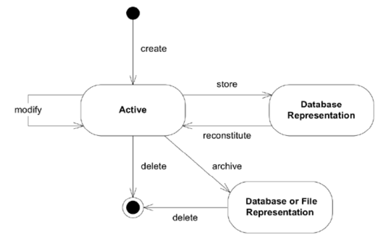
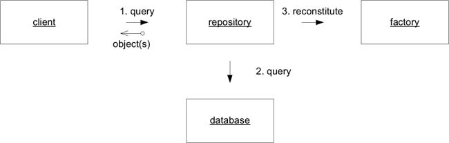

## 06_도메인 객체의 생명주기

### 들어가기 전에
> (...) 객체들은 (...) 더 오래 지속되며, 활성 메모리 안에서만 시간을 보내지는 않는다. 그것들은 다른 객체와 복잡한 상호의존성을 맺는다. 또한 여러 가지 상태의 변화를 겪기도 하는데, 이때 갖가지 불변식이 적용된다. 이러한 객체들을 관리하는데 실패한다면 MODEL-DRIVEN DESIGN을 시도하는 것이 쉽게 좌절될 수 있다.

#### 도메인 객체의 관리와 관련된 문제
> 1. 생명주기 동안의 무결성 유지하기
> 2. 생명주기 관리의 복잡성으로 모델이 난해해지는 것을 방지하기

#### 해결 방법
1. Aggregate(집합체) 패턴 : 소유권과 경계를 명확히 정의 (생명주기 전 단계에서 불변식의 유지범위 표시)
2. Factory 패턴 : 복잡한 객체와 Aggregate를 생성 / 재구성 (생명주기 간 이동에 따른 복잡성 캡슐화)
3. Repository 패턴 : 영속 객체를 찾아 조회 가능 (생명주기 간 이동에 따른 복잡성 캡슐화)

#### 목표
> Aggregate를 모델링하고 설계에 Factory와 Repository를 추가하면 모델 객체의 생명주기 동안 그것들을 체계적이고 의미있는 단위로 조작할 수 있다.

### Aggregate (집합체)

대부분의 업무 도메인에서 어플리케이션 내부의 객체들은 서로 얽혀있음
- 동일한 객체에 여러 클라이언트가 접근하는 시스템의 경우 트랜잭션의 범위를 명확히 한정지어야 함
- 개별 객체가 아닌 밀접한 관계의 객체 집합에 불변식을 적용해야 함
  - 그러나 신중 잠금 기법(cautious locking scheme)을 쓰면 다수의 사용자가 서로 부적절하게 간섭함
  - 데이터베이스에서 제공하는 잠금 기법들도 임시방편적 해결일 뿐
  - 결국 **도메인을 심층적으로 이해**해야 함

#### Aggregate의 구성 요소
- Boundary(경계) : Aggregate에 무엇이 포함되고 포함되지 않는지 정의
- Root(루트) : 한 Aggregate에 하나의 루트만 존재. Aggregate에 포함된 특정 Entity를 가리킴. 경계 바깥의 객체는 루트만 참조 가능.

##### ROOT Entity
- 전역 식별성을 지니며, 궁극적으로 불변식을 검사할 책임이 있다.
- Aggregate의 경계 밖에서는 루트 Entity를 제외한 Aggregate 내부의 구성요소를 참조할 수 없다. 루트 엔티티가 내부 엔티티에 대한 참조를 다른 객체에 전달해 줄 수는 있지만 그러한 객체는 전달받은 참조를 일시적으로만 사용할 수 있다.
- 삭제 연산은 Aggregate 경계 안의 모든 요소를 한 번에 제거해야 한다. (Managed 언어의 경우 외부의 루트 참조만 삭제하면 됨) 

### Factory (팩터리)

> 어떤 객체나 전체 Aggregate를 생성하는 일이 복잡해지거나 내부 구조를 너무 많이 드러내는 경우 Factory가 캡슐화를 제공해준다.

> 객체의 장점 중 상당 부분은 객체의 내부구조와 연관관계를 정교하게 구성하는 데서 나온다.

> 문제는 이러한 책임만으로도 복잡한 객체에 객체 자체를 생성하는 책임까지 맡기는 데 있다.
> (...) 차를 조립하는 기능은 자동차를 생산하는 동안에나 필요할 뿐 운전할 때는 로봇이나 조립공이 필요하지 않다.
> (...) 그러나 애플리케이션에서 그와 같은 책임을 클라이언트 객체로 옮긴다면 문제가 훨씬 더 나빠진다.
> (...) 직접 조립해야 한다면 클라이언트도 도메인 객체의 내부구조를 어느 정도 알고 있어야 한다.
> (...) 클라이언트를 변경하지 않고는 도메인 객체의 구현을 변경할 수 없으며, 이로써 리팩터링이 더 힘들어진다.

> 복잡한 조립 연산은 생성된 객체의 책임으로 어울리지 않는다.

#### Factory를 잘 설계하기 위한 기본 요건

1. 각 생성 방법은 원자적(atomic)이어야 하며, 생성된 객체나 AGGREGATE의 불변식을 모두 지켜야 한다.
2. FACTORY는 생성된 클래스보다는 생성하고자 하는 타입으로 추상화돼야 한다.

#### FACTORY와 FACTORY의 위치 선정

1. AGGREGATE 루트에 FACTORY METHOD를 만들 수 있음.
    - 한 요소가 추가 될 때 AGGREGATE의 무결성을 보장하는 책임을 루트가 담당함.
    - 모든 외부 클라이언트에게서 AGGREGATE의 내부 구현을 감출 수 있음.
2. 생성된 객체를 소유하지는 않지만 다른 객체를 만들어내는 것과 밀접한 관련이 있는 특정 객체게 FACTORY METHOD를 둠.
    - 한 객체의 데이터나 규칙이 객체를 생성하는 데 매우 크게 영향을 주는 경우 어떤 다른 곳에서 해당 객체를 생성할 때 생산자의 정보를 필요로 하는 것을 줄일 수 있음.
    - 생산자와 생성된 객체 사이의 특별한 관계를 전해주기도 함.
3. 전용 FACTORY 객체나 SERVICE를 만들 수 있음.
    - 특정 AGGREGATE 안의 어떤 객체가 FACTORY를 필요로 하는데 AGGREGATE 루트가 해당 FACTORY가 있기에 적절한 곳이 아닐 경우.
4. 생성자만으로 충분한 경우
    - 클래스가 어떤 계층구조의 일부를 구성하지 않으며, 인터페이스를 구현하는 식으로 다형적으로 사용되지 않는 경우
    - 클라이언트가 STRATEGY를 선택하는 한 방법으로서 구현체에 관심이 있는 경우
    - 클라이언트가 객체의 속성을 모두 이용할 수 있어서 클라리언트에게 노출된 생성자 내에서 객체 생성이 중첩되지 않는 경우
    - 생성자가 복잡하지 않은 경우
    - 공개 생성자가 FACTORY와 동일한 규칙을 반드시 준수해야 하는 경우.
    
#### 불변식 로직의 위치

> 대체로 불변식은 모든 연산의 마지막에 적용되지만 이따금 객체를 변형하는 탓에 불변식이 결코 제 역할을 다하지 못할 때도 있다.
> 가령 ENTITY의 식별 속성을 할당하는 데 적용되는 규칙이 있을지도 모른다.
> 그러나 ENTITY가 생성되고 나면 해당 식별성을 불변성을 띠게 된다.
> VALUE OBJECT는 완전히 불변적이다. 객체를 해당 객체가 활동하는 생애 동안 결코 적용되지 않을 로직을 수행할 필요는 없다.
> 그런 경우에는 FACTORY가 불변식을 둘 논리적인 위치가 되며, 생성물은 더욱 단순하게 유지된다.

#### ENTITY FACTORY와 VALUE OBJECT FACTORY

1. Entity Factory
    - 유효한 AGGREGATE를 만드는데 필요한 필수 속성만 받아들이면 됨. 세부사항은 나중에 추가해도 됨
    - 식별성 할당을 신경써야 함
2. Value Object Factory
    - 생성물이 완전히 최종적인 형태로 만들어져야 함.
    - 식별성 할당을 신경쓸 필요 없음

#### 저장된 객체의 재구성

생성에 사용된 FACTORY와 재구성에 사용된 FACTORY의 차이점

1. 재구성에 사용된 ENTITY FACTORY는 새로운 ID를 할당하지 않는다. (연속성을 유지하기 위함)
2. 객체를 재구성하는 FACTORY는 불변식 위반을 다른 방식으로 처리할 것이다.

### Repository (리파지터리)

- 재구성(Reconstitution) : 저장돼 있는 객체로부터 인스턴스를 만들어 내는 것

> 도메인 주도 설계의 목표는 기술보다는 도메인에 대한 모델에 집중해 더 나은 소프트웨어를 만들어내는 것이다.

> 인프라스트럭처에서 도메인 객체의 참조를 쉽게 획득할 수 있게 해준다면 클라이언트 측을 개발하는 개발자들이 좀더 탐색 가능한 연관관계를 추가해 모델을 엉망으로 만들어 버릴지도 모른다.
> 한편으로는 AGGREGATE 루트에서부터 순회하지 않고 정확히 필요한 데이터를 데이터베이스에서 뽑아내거나 몇 가지 특정한 객체를 가져오는 데 질의를 사용할 수도 있다.

> 마음대로 데이터베이스에 질의를 수행하면 실제로 도메인 객체와 AGGREGATE의 캡슐화를 어길 수도 있다.
> 기술적 인프라스트럭처와 데이터베이스 접근 메커니즘을 드러내면 클라이언트가 복잡해져서 MODEL-DRIVEN DESIGN이 불분명해질 것이다.

-  Repository는 특정 타입의 모든 객체를 (대개 모방된) 하나의 개념적 집합으로 나타낸다. 더욱 정교한 질의 기능이 있다는 점을 제외하면 REPOSITORY는 컬렉션처럼 동작한다.

-  전역적인 접근이 필요한 각 객체 타입에 대해 메모리상에 해당 타입의 객체로 구성된 컬렉션이 있다는 착각을 불러 일으키는 객체를 만든다.

#### REPOSITORY의 장점

- 영속화된 객체를 획득하고 해당 객체의 생명주기를 관리하기 위한 단순한 모델을 클라이언트에게 제시함
- 영속화 기술과 다수의 데이터베이스 전략, 또는 심지어 다수의 데이터소스로부터 애플리케이션과 도메인 설계를 분리해줌
- 객체 접근에 관한 설계 결정을 전해줌
- 테스트에서 사용할 가짜 구현을 손쉽게 대체할 수 있음 (보통 메모리상의 컬렉션을 이용)

#### REPOSITORY의 구현

- 타입을 추상화한다.
- 클라이언트와의 분리를 활용한다.
- 트랜잭션 제어를 클라이언트에 둔다.

#### Factory와의 관계

FACTORY가 객체 생애의 초기 단계를 다루는 데 반해 REPOSITORY는 중간 단계와 마지막 단계를 관리하는 데 도움된다.

- REPOSITORY가 FACTORY로 객체 생성을 위임할 수도 있음

- "찾아서 없으면 생성하는(find or create)" 기능을 사용하는 것은 자제해야 함
    > 일반적으로 새로운 객체와 이미 존재하는 객체를 구분하는 것은 도메인에서 중요
